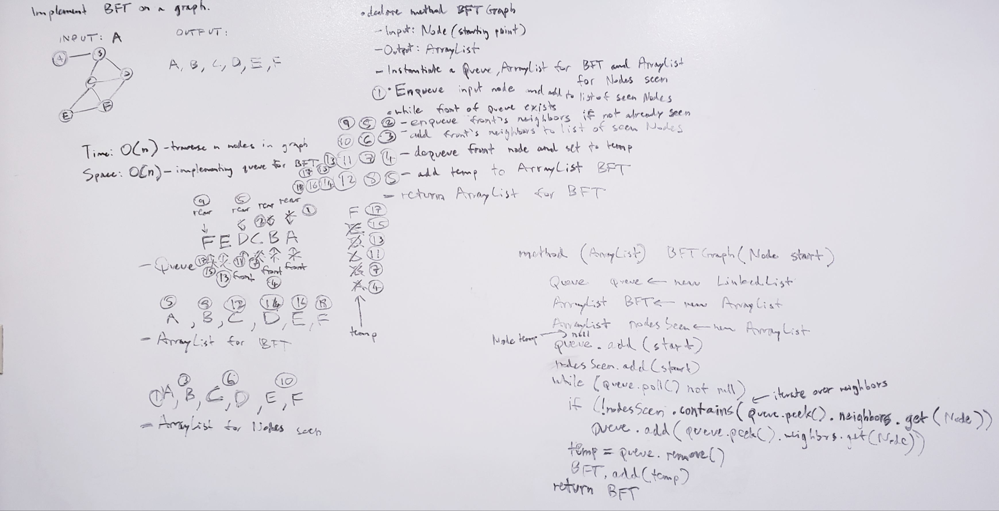

# Graph implementation
Implement a graph's methods (addNode, addEdge, getNodes, getNeighbors, size, BFT, depthFirst). 

## Challenge Description
addNode(): adds new node to graph, takes in value of node, returns added node. 

addEdge(): adds new edge between two nodes in graph, include ability to have weight, take in two nodes to be connected, both nodes already in graph. 

getNodes(): return all nodes in graph as collection. 

getNeighbors(): return collection of all nodes connected to given node, including weight of connection in returned collection. 

size(): return size of the graph (number of nodes that exist in it). 

BFT(): given a node in the graph, traverse through its neighbors and return a list of nodes traversed breadth-first. 

depthFirst(): traverse depth-first pre-order-wise a graph. 

## Approach & Efficiency
addNode(): Instantiate a node given a value, add it to a pre-instantiated list of nodes in a graph, and return that node. O(1) time and O(n) space for every node added. 

addEdge(): Since every graph contains a node or nodes, and each node contains a set of edge or edges it connects to, specify that a new edge
must contain a weight and the node it will connect to. Also use the second node to create the same edge but pointing to the first node. These 
are technically two edges with how I implemented this, but it's a way to satisfy the requirements for a standard bidirectional graph. O(1) time
for a set of two nodes and O(n) space for the new edges and weight of each created. 

getNodes(): For every node in the list of nodes, get its value and add it to an arraylist to return it. O(n) time to iterate through each node
to add to arraylist and O(n) space for the arraylist created. 

getNeighbors(): Return the collection of neighbors for a given node. O(n) time worst case assuming the node is connected to every other node in the graph. 
O(n) space for the array made to contain the nodes and weights of the edges. 

size(): Iterate through the list of nodes in the graph to get the size O(n) time and O(n) space for containing those nodes in a list. 

BFT(): Instantiate a queue to keep track of what nodes to traverse next. Instantiate an arraylist to keep track of the nodes traversed. Also 
instantiate an arraylist to keep track of all the nodes seen so far to avoid traversing in a direction already passed. Add the start node to the queue. 
Then add it to the list of seen nodes. While a front node in the queue exists, enqueue its neighbors and then add the neighbors to the list 
of seen. Dequeue the front node, set it to a temp, and add its value to the arraylist of traversed nodes. It takes O(n) time to traverse n neighbors
of the start node. It takes O(n) space worst case to store the neighbors of the start node if all nodes in the graph are connected to start. 

depthFirst(): Create a function that accepts an adjacency list as a graph, and conducts a depth first traversal. Without utilizing any of 
the built-in methods available to your language, return a collection of nodes in their pre-order depth-first traversal order. It takes O(n) 
time to traverse depth-first. It takes an order of O(n) space to make a list of nodes not yet seen. 

## Solution BFT

