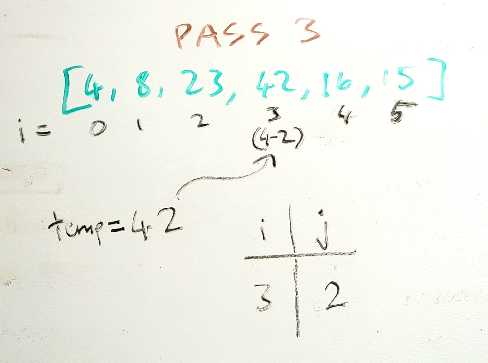

#Insertion Sort

Insertion sort is a sorting algorithm that traverses an array of numbers, checks to see if a given number in an iteration is smaller than the numbers before it, and pushes all larger numbers ahead by 1 spot to place the given number in the right spot. 

## Pseudocode
```aidl
SelectionSort(int[] arr)
    FOR i = 1 to arr.length
    
        int j <-- i - 1
        int temp <-- arr[i]

        WHILE j >= 0 AND temp < arr[j]
            arr[j + 1] <-- arr[j]
            j <-- j - 1

        arr[j + 1] <-- temp
```

## Trace
Sample Array: `[8,4,23,42,16,15]`

**Pass 1:**

In the first pass through of insertion sort, i = 1 (the 2nd value). j is assigned 1 less than i (effectively the index before the current ith iteration, 0), and a temp variable is assigned the 2nd value of the array (4). 
The while loop's condition will be true, since the temp variable is less than the value before arr[i] (8), and j is greater than or 0. In the while loop, arr[j+1] (4) gets arr[j] (8), placing the smaller value where the larger value should be. This is where the first part of swapping occurs. 
j is then decreased by 1 to continue to look at any values before the current pair. 
The while loop is run again, but this time j is -1, so control flow exits this loop. 
Outside the while loop, the first value of the array gets the temp variable, 4. This concludes the swapping for this pass. 

**Pass 2:**

Now, the array is `[4,8,23,42,16,15]`. In the second pass, i = 2, which means that j = 1. The pattern is evident now; for every value being evaluated, we pair it with the value before to compare whether it is larger. In this case, we are comparing 23 and 8 (temp is 23 and arr[i-1] is the value before, 8). 
In the while loop, j is greater than or 0, but temp (23) is not less than arr[j] (8), so there is no need for swapping. 
arr[j+1] (23) gets the temp variable, which is 23, so no effective swapping occurred. 

**Pass 3:**

Just as with pass 2, our current temp variable (arr[i]) is now 42, and arr[j] (arr[i-1]) is 23. There is no need for swapping, so the while loop isn't entered, and the arr[j+1] (42) gets 42. 

**Pass 4:**

On this iteration, it's clear that 16 needs to precede 23 and 42, but come after 4 and 8. 
arr[j] is 42, and arr[i] (temp) is 16. The while loop is entered, since j is greater than or 0 and 16 is less than 42. 42 is swapped with 16 and j is decremented. 
The while loop evaluates to true again, since j >= 0 and 16 is still less than arr[j], which is now 23. 23 is placed into the position after. 
On this iteration of the while loop, j is greater than or 0, but 16 is not less than 8, so the while loop is exited. 
arr[j+1] gets 16, which places everything in the correct sorting order up to this ith iteration. 

**Pass 5:**

Similar sentiment is repeated on this iteration; 15 is less than 42, so 42 is placed into the spot after. 23 and 16 also get moved up 1 spot in the array. 
Once 16 is evaluated to be not less than 15, the while loop is exited and 15 is placed before 16. The array is now sorted. 

## Efficiency
- Time: worst case is O(n^2) assuming a completely reversed array, since for every ith iteration of the array, every n value before the current examined value n has to be moved up by 1 spot. 
- Space: O(1) additional space for a temporary variable, which is the variable currently being examined and compared to values before it. 