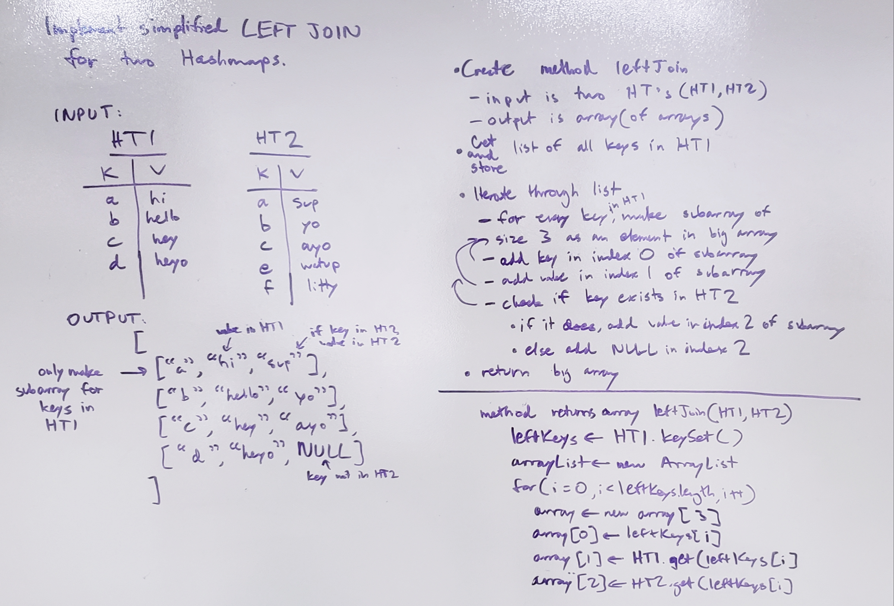

# Hashmap LEFT JOIN
Implement a LEFT JOIN on two hashmaps. 

## Challenge
Given two hashmaps, get the keys of the left hashmap and return its values, along with the values of the right hashmap if the same key exists in it. 

## Approach & Efficiency
Create a method leftJoin() whose inputs are the two hashmaps (HT1 and HT2) and returns an array (of arrays). 
Get and store all the keys in HT1. 
Iterate through those keys. 
For every key in HT1, make a subarray of size 3 as an element in a superarray. 
Add that key in index 0 of the subarray. Add that key's value in index 1. If that key in HT2 exists, add HT2's value for that key in index 2 of the subarray. 
If it doesn't, add NULL in index 2. 

## Solution
