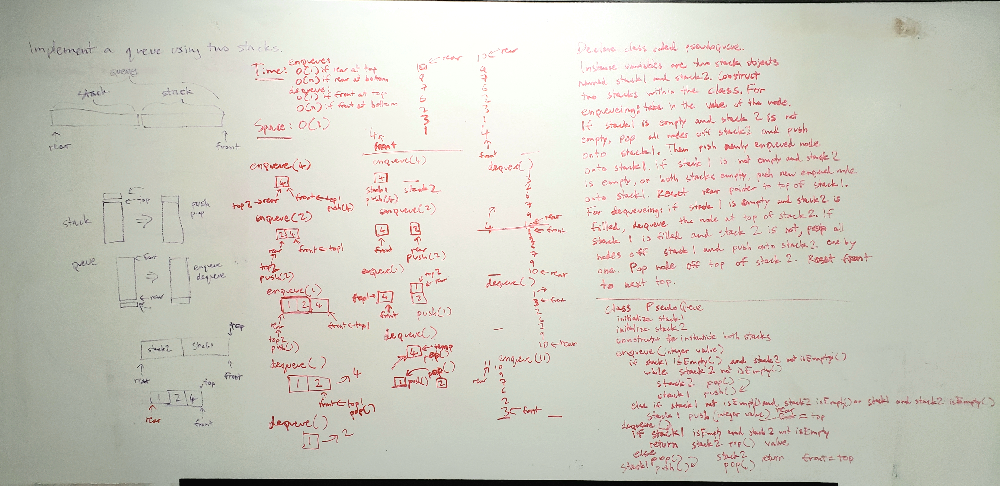

# Table of Contents
- Linked List
- Stack and Queue
- Pseudoqueue
- Tree

# Singly Linked List
This is a data structure that contains objects called nodes. These nodes contain a value and a single pointer to another node. 

## Challenge
We are challenged to put our understanding of singly linked lists to the test. We are expected to instantiate a linked list, add values to the list, test if a value is included in the list, and print values in the list, and insert nodes at the end, and before and after a specified node. 

## Approach & Efficiency
- For each method, I ensure that I'm following the steps meticulously, since misplacing a tracker node or dereferencing when you shouldn't can lead to errors and loss of data. 
- Efficiency of insert() is O(1) time and O(1) space since the node is always being inserted at the get-go. 
- Efficiency of includes() is O(n) time and O(1) space since no additional space is being used to return a boolean, and worst case scenario is the search value is at the end of the list. 
- Efficiency of toString() is O(n) time and O(1) space since you must traverse the list fully to get the values to print. 
- Efficiency of append() is O(n) time and O(1) space since 1 node is being inserted and you must traverse the list of n nodes. 
- Efficiency of insertBefore() and insertAfter() is O(n) time and O(1) space since 1 node is being inserted, and worst case is the node to search for is at the end of the list of n nodes. 
- Efficiency of kthFromEnd() is O(n) time and O(1) space since no additional space is being used, but worst case k is 0, which means you must traverse the list fully to get the last value. 
- Efficiency of mergeLists() is O(n) time and O(1) space since you must traverse both lists fully, but no additional space is being used to get the merged list - however, the original data is mutated. 

## API
- insert() inserts a node at the head of the linked list. 
- includes() returns true if an input value is also a value in a node in the list. It returns false if the value is not present in the list. 
- toString() prints out all the values present in the list. 
- append() inserts a node at the end of the list. 
- insertBefore() inserts a node before a specified node's value. 
- insertAfter() inserts a node after a specified node's value. 
- kthFromEnd() returns the value of a node k nodes from the end of the list.
- mergeLists() takes in two linked lists and returns the first linked list that will contain the merge. Original data is mutated. 

## Solution
- append, insert before, insert after .jpg) .jpg) .jpg)
- kth from end 
- merge two linked lists 

# Stacks and Queues
These are data structures that operates on the same principles as a linked list - the difference being that stacks rely on tracking the most recently added node, and queues rely on tracking both the last and most recent node. Pseudoqueues operate like queues, but implement two stacks within its structure instead.

## Approach and Efficiency
- For each method, I ensure that the trackers (front, rear, top, etc.) are referenced properly, and nodes being added/removed are kept track of as well. 
- Efficiency of stack's push(), pop(), peek(), and isEmpty() are O(1) in time, because no matter how many nodes are in the list, it's only 1 operation per stack. 
- Efficiency of queue's enqueue, dequeue, peek(), and isEmpty() are O(1) in time for the same reason per queue. 
- Efficiency of pseudoqueue is O(1) in space because it utilizes the same two stacks for dequeueing or enqueueing, and O(n) in time, worst case assuming dequeueing has to occur while all nodes are in the enqueue stack, and vice versa. 

## API
- Stack (First In, Last Out; Last In, First Out)
  - push() adds a node to the top of the stack and resets the top to that node. 
  - pop() removes a node from the top of the stack and resets the top to the node below. 
  - peek() returns the value of the top node. 
  - isEmpty() returns true if a stack is empty, and false if it's filled. 
- Queue (First In, First Out; Last In, Last Out) 
  - enqueue() adds a node to the front of the queue and resets the front to that node. 
  - dequeue() removes a node from the front of the queue and resets the front to the node after. 
  - peek() returns the value of the front node. 
  - isEmpty() returns true if a queue is empty, and false if it's filled. 
- PseudoQueue
  - enqueue() pushes a node to the enqueue stack if it's already filled. If enqueue stack is empty and dequeue stack is filled, it pop()'s off dequeue and push()'s to enqueue() until dequeue is emptied, then push()'s the newly added stack. 
  - dequeue() follows the same process as enqueue(), except returns the value of the last enqueue()'d node. 

## Solution for Pseudoqueue

# Trees
This data structure is hierarchical as opposed to other DSA covered so far, which are linear. 

## Challenge
A node on a tree can contain multiple pointers to other nodes. A node can be connected from another node by those pointers. The challenge is to create trees through add(), check if a tree contains() a node, and also traverse trees through preorder, inorder, and postorder methods that take in a specified root of the tree. 

## Approach & Efficiency
- Approach for depth-first traversal: Recursion is key in solving these problems. My approach was to identify what aspect of the tree needs to be recursed. For example, if you are adding a node and you'd like to traverse the tree to find where to add the node, if a node doesn't match what the search value of the input node is, and the current root's value is larger than the search value, go to the left and check the rest of the root. This works because subtrees exist within trees, and you can apply the same method on that subtree the same way you did on the original tree when starting out. 
- Approach for breadth-first traversal: the key is realizing that all nodes must be traversed top-down. Using a queue, add the root of the tree to the queue. Dequeue the front of the queue which would be the current root reference, add it to an answer holder, and then enqueue the root's left and right nodes. While the queue is still filled, repeat this process. Return the final list. 
- Big O: for add() and contains(), the best case (assuming a balanced tree, which is a height difference of no more than 1 at any node's left vs. right) is O(log n). The worst case (assuming an unbalanced tree) is O(n) - all the nodes end up on the same side (left or right). 
- Big O: for preOrder(), inOrder(), and postOrder(), O(n) because n nodes in the tree must all be traversed. O(n) additional space in order to return a list of n nodes. 
- Big O: for breadthFirst(), O(n) time to traverse n nodes in tree and O(n) additional space because a new list is made of n nodes. 

## API
- preOrder() traverses a tree looking at the root first, then left, then right of every node. It returns a linked list of the nodes in the tree. 
- inOrder() does the same, except through traversing by left first, then root, then right. 
- postOrder() does the same, except through traversing by left first, then right, then root. 
- add() adds a node to a tree according to binary search tree convention (all values to the left of a node must be smaller and all values to the right must be larger). 
- contains() returns a boolean if an input value is contained within a tree's node or not. 
- breadthFirst() returns a list of the nodes in a tree that was traversed breadth-first as opposed to depth-first (preorder, inorder, postorder). 

## Solution Breadth-First
