# Merge Sort

Merge sort is a sorting algorithm that takes an array, splits it in two, and repeats the process until two sorted child arrays of a parent array contain only 1 element, and sorts the values back into the parent array. This process continues recursively until the final array is sorted. 

## Pseudocode
```aidl
ALGORITHM Mergesort(arr)
    DECLARE n <-- arr.length
           
    if n > 1
      DECLARE mid <-- n/2
      DECLARE left <-- arr[0...(mid - 1)]
      DECLARE right <-- arr[mid...(n - 1)]
      // sort the left side
      Mergesort(left)
      // sort the right side
      Mergesort(right)
      // merge the sorted left and right sides together
      Merge(left, right, arr)

ALGORITHM Merge(left, right, arr)
    DECLARE i <-- 0
    DECLARE j <-- 0
    DECLARE k <-- 0

    while i < left.length && j < right.length
        if left[i] <= right[j]
            arr[k] <-- left[i]
            i <-- i + 1
        else
            arr[k] <-- right[j]
            j <-- j + 1
            
        k <-- k + 1

    if i = left.length
       set remaining entries in arr to remaining values in right
    else
       set remaining entries in arr to remaining values in left
```

## Trace
The premise of merge sort is that, given an array, get the length of the array, the midpoint, and declare two new arrays that each contain either the left or right half of the array. 
Merge those arrays once the left and right halves are made, but only once the halves have been sorted against each other. 
Call the method that does array splitting on each half of the array. This will be a recursive process until each half of a parent array is a length of 1. 
Another function will merge each half into a final sorted parent array, which reels back on the recursive call stack until the final parent array is sorted. 
Take a look at the sample array and the steps below: 

Sample Array: `[8,4,23,42,16,15]`

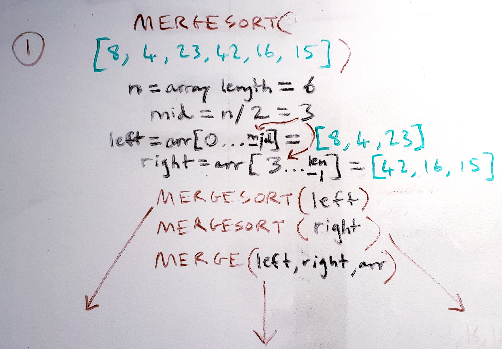
* Mergesort() is called on the initial array. Given the array length of 6 (greater than 1), the midpoint is found to be 3. Two halves of the array are made: `[8,4,23]` and `[42,16,15]`. 
Mergesort() is called on each half, and then a Merge() function that contains the sorted left half, right half, and the original array. But Merge() isn't called until Mergesort() is completed; and since Mergesort() only breaks out when an array length is 1, Mergesort() will continue to break each half until that condition is met. 

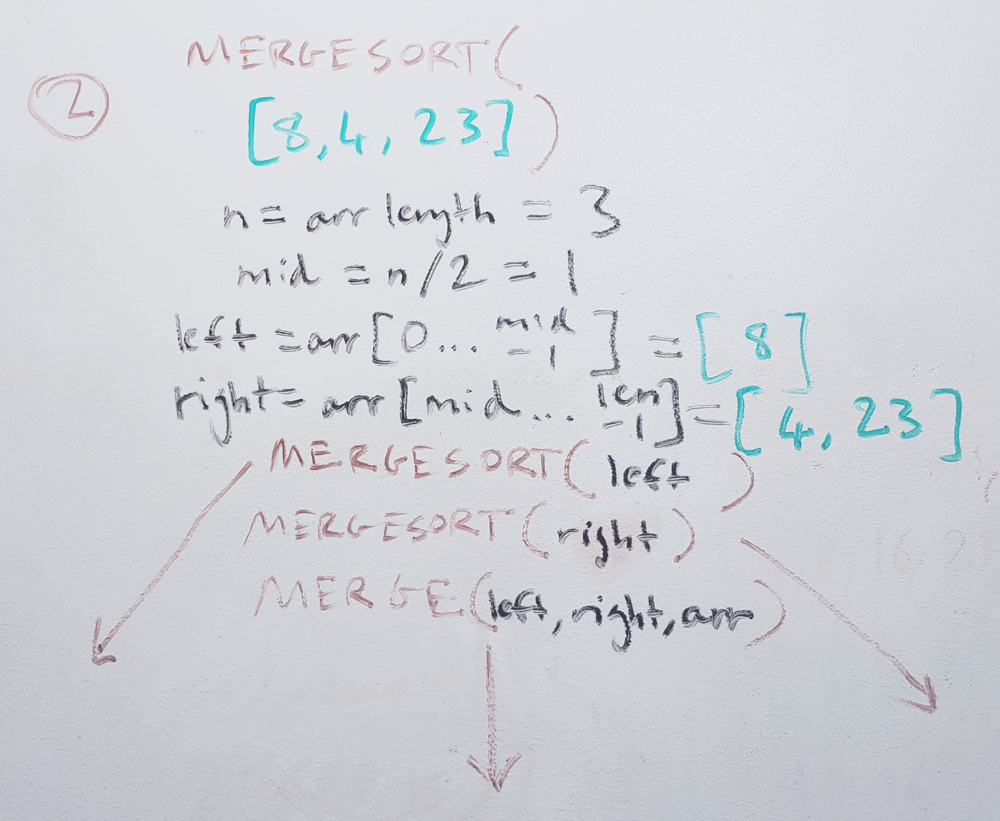
* Looking at a Mergesort() on the left half, the length is 3 and the midpoint is rounded down to 1. Two halves are made again: `[8]` and `[4,23]`. The recursive process of calling Mergesort() on each half is repeated again, along with a final Merge() once each half is a length of 1. 

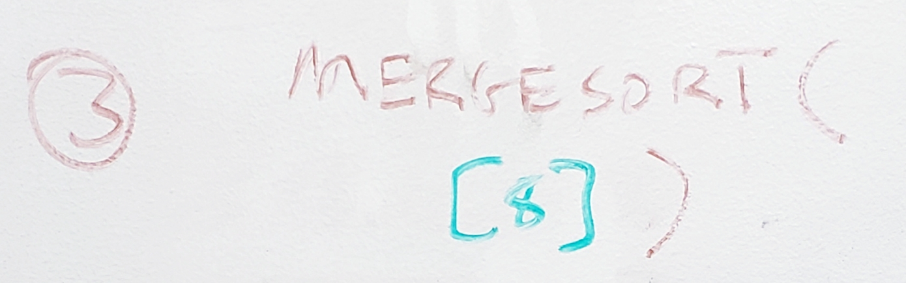
* The left half of the previous parent is `[8]`. The length is 1, hence no more array splitting. Nothing will be done to this half, and thus recursion stops on this half. 

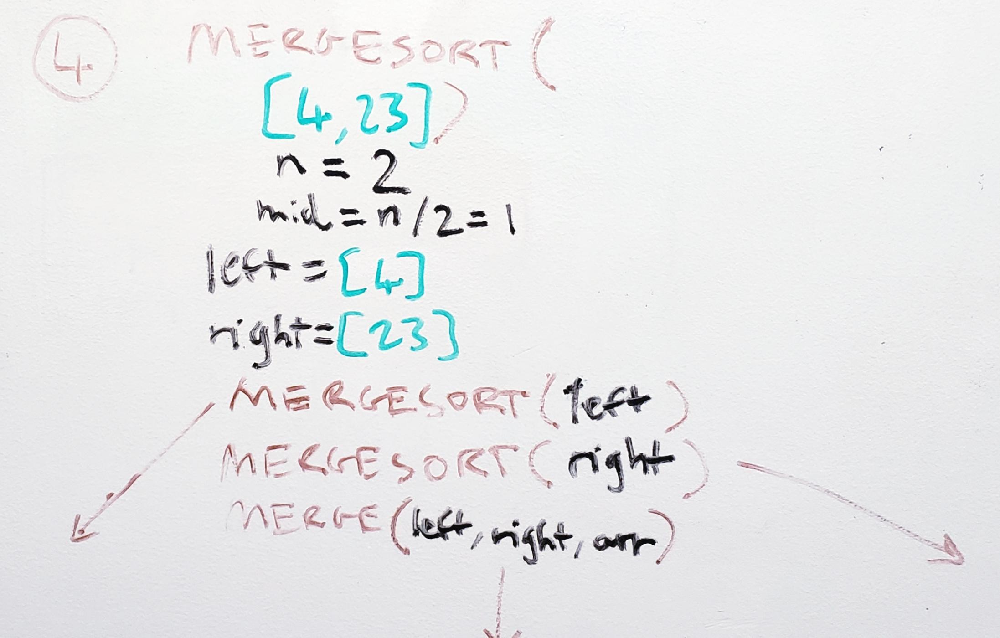
* The right half is still a length of 2, so more splitting will occur. Once each half is `[4]` and `[23]`, Mergesort() won't continue on to recurse. 

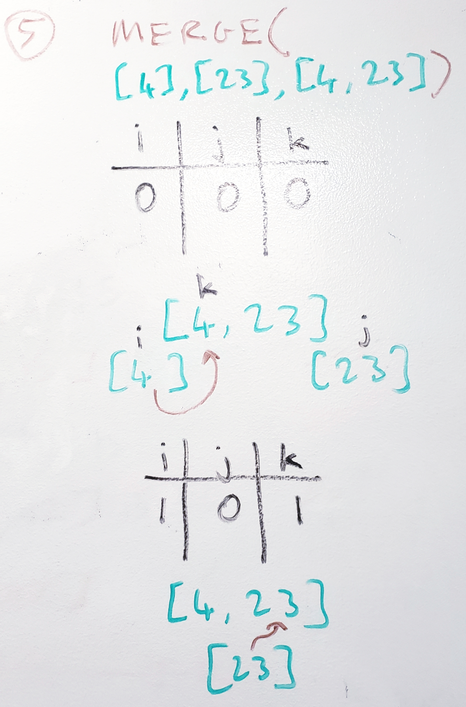
* At this point, the right half `[4,23]` was split completely. Now Merge() will be called on the two halves `[4]` and `[23]` along with the parent `[4,23]`. The while loop is entered; this ensures that each child array is iterated through completely until all values have been added to the parent array. 
Iteration of each array (i, j, k) will begin in order to sort the parent array. Since the left half's first value `4` is smaller than or equal to the right half's first value `23`, the left half's value will be placed first into the parent array. `i` and `k` are incremented, but `j` isn't, since that value hasn't been added yet. 
The while loop will be broken after this incrementation, since the left array was completely iterated through. All that is left to do is to add the remaining values of the right half into the parent array, which is just the `23`. 
Merging of `[4,23]` is now complete. 

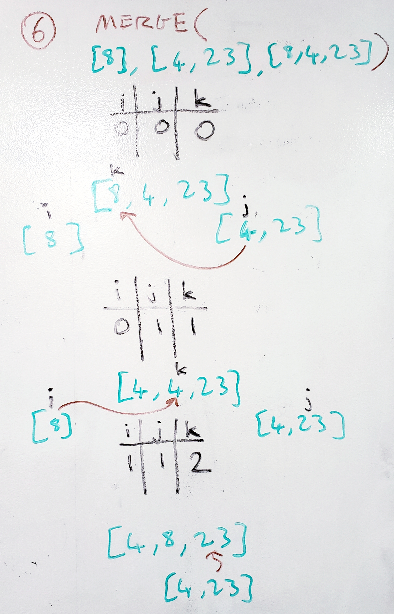
* Now, the parent `[8,4,23]` will need to be sorted. Since the halves `[8]` and `[4,23]` were each sorted as much as possible, Merge() will be called on this parent. 
Once again, the two halves are taken in along with the parent array. Incrementation of each array begins. The right half's first value is found to be less than the left half's first, thus it is added first to the parent. `j` and `k` are incremented this time. 
Now the left half's current value `8` is found to be less than the right half's current `23`, thus it is added next. 
`i` and `k` are incremented. 
The left half was iterated through completely, thus the while loop breaks out, and the remaining values of the right half are added to the remaining spots in the parent array, which is `23`. 
Merge() is complete on this parent. 

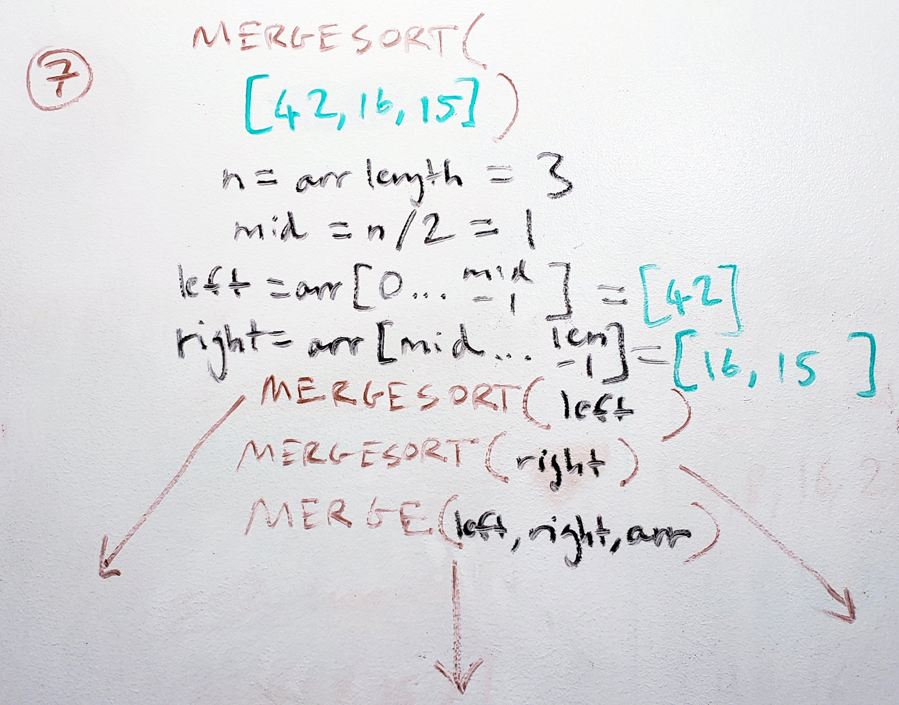
* Since the left half `[8,4,23]` of the original parent array `[8,4,23,42,16,15]` is complete, the right half merge sort will begin. 
`[42,16,15]` will be broken down into halves until all halves are of length 1, then sorted into each parent array. 

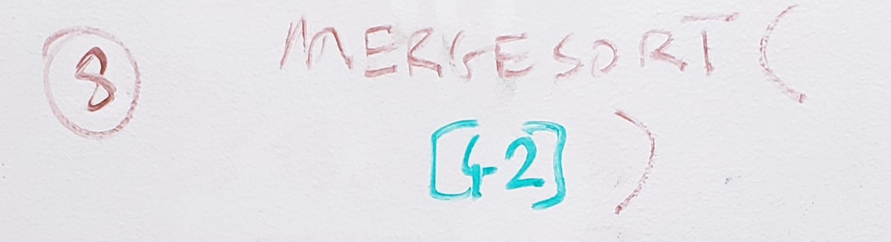
* `[42]` is the first child array that has a length of 1, thus no more splitting. 

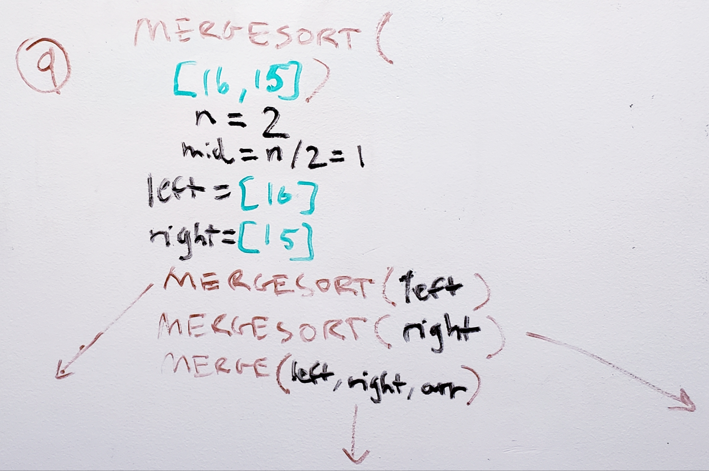
* `[16,15]` are split into `[16]` and `[15]`. 

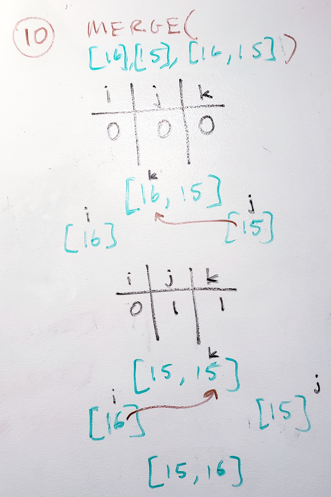
* Now that there are two length 1 arrays, they will be merged and sorted with Merge(). As before, each array is incremented through, and the halves are checked against each other to see which value comes before the other to be placed in the parent array. 

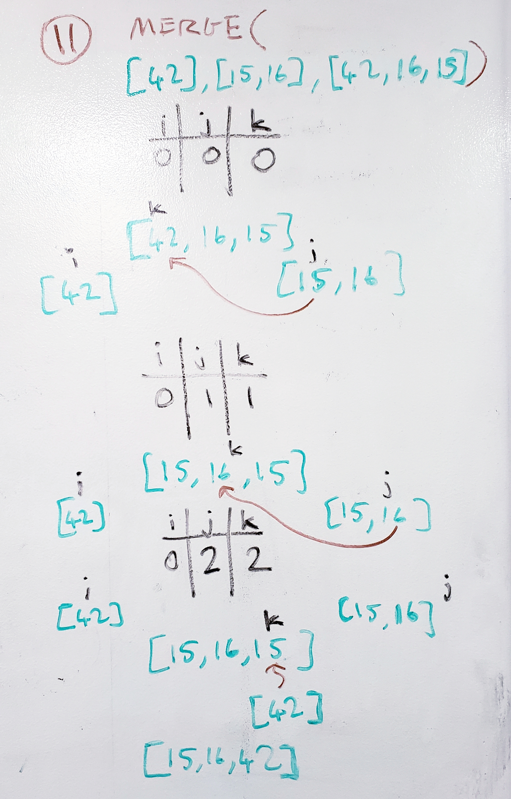
* `[15,16]` is sorted, and then the parent `[42,16,15]` is sorted with its halves. 

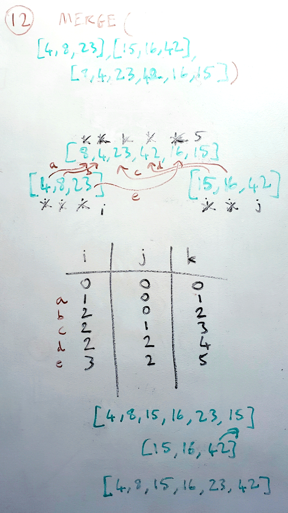
* Finally, the original array gets Merge() called on it along with its sorted halves `[4,8,23]` and `[15,16,42]`. 
It takes more iterations. Labels are given to each step, as shown in the picture. 
The final array is sorted to be `[4,8,15,16,23,42]`. 

## Efficiency
* Time: O(n*log(n))
  - Looking at Merge(), we observe that it takes n iterations to run through the full length of the parent array to get all its child values in. Thus, Merge() has a time complexity of n. 
  - Mergesort() alone splits its parent array into two halves until all children are a length of 1. For every halving of a parent array, it takes log(n) times to split it down to children of length 1. 
  - Combining these two functions, the overall time efficiency of Merge() is O(n * log(n)). 
* Space: O(n*log(n))
  - For every splitting of the tree, we make n new elements, since the children will contain all the parent elements, just split into two arrays. 
  Since there are log(n) splits until the final children are a length of 1, and n new spaces are made for each split, space complexity is O(n*log(n)).
