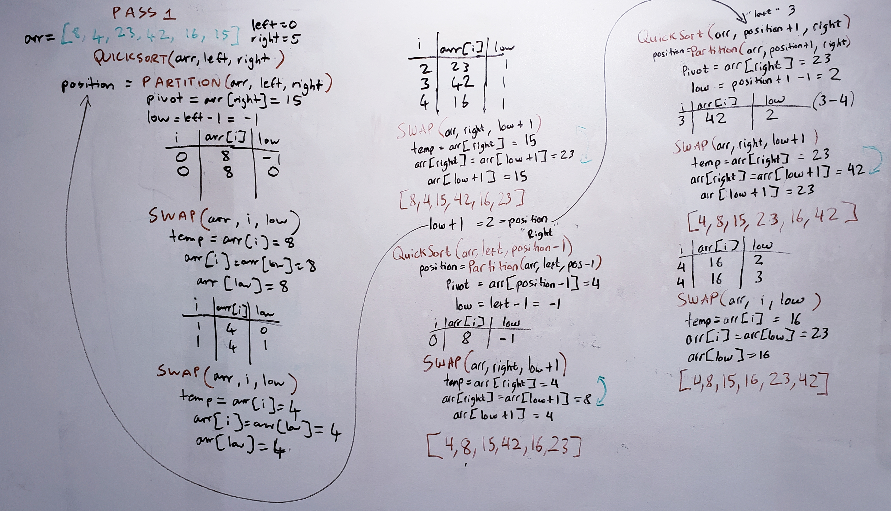

# Quick Sort

The name of this sorting algorithm implies a faster way of sorting an array than merge sort or insertion sort. It takes in the array to be sorted, 
the first number at the left of the array, and the last number at the right of the array. It will pick the 'pivot' point as the right side of the array, 
swaps numbers to partition sorting to the left side of the pivot and the right side, and then swaps again to return the final sorted array. 


## Pseudocode
```aidl
ALGORITHM QuickSort(arr, left, right)
    if left < right
        // Partition array by setting position of pivot value 
        DEFINE position <-- Partition(arr, left, right)
        // Sort left
        QuickSort(arr, left, position - 1)
        // Sort right
        QuickSort(arr, position + 1, right)

ALGORITHM Partition(arr, left, right)
    // set a pivot value as a point of reference
    DEFINE pivot <-- arr[right]
    // create variable to track largest index of numbers lower than defined pivot
    DEFINE low <-- left - 1
    for i <- left to right do
        if arr[i] <= pivot
            low++
            Swap(arr, i, low)

    // place value of pivot location in middle
    // all numbers smaller than pivot are on left, larger are on right
    Swap(arr, right, low + 1)
    // return pivot index point
    return low + 1

ALGORITHM Swap(arr, i, low)
    DEFINE temp;
    temp <-- arr[i]
    arr[i] <-- arr[low]
    arr[low] <-- temp
```

## Trace
Sample array: `[8,4,23,42,16,15]`

Please refer to the trace below. 

This algorithm takes in a sample array, the number at index 0, and the number at the last index; in this case, 8 and 15. 
If left is less than right (8 < 15), run the partition function, which takes in the array, left and right. The output of partition() 
will be set to a number declared `position`. 

In this run of partition(), a pivot will be declared as the number at the right of the array (pivot = 15). Low will be defined as left - 1 
(low = left - 1 =  0 - 1 = -1). We then loop through the length of the array (for 0 up to 5) and execute the following. If the array at i is less 
than or equal to the pivot, increment low and run the swap function. 

Array[0] is 8, less than or equal to pivot (15). Low is incremented (low++ = low = 0 + -1 = 0). Swap() is called, taking in the array, i, and
low. 

In swap(), arr[i] and arr[low] are swapped. temp is defined as arr[i], which is 8. arr[i] then gets arr[low], which is also 8. 
arr[low] gets temp, which is 8. As observed, no real swapping of values was done in this iteration. 

Back in partition's next iteration, i is now 1, and arr[i] is 4, which is also less than pivot (15). low = low++ = 1. Swap() is called again,
and yet again no effective swapping is done, since we swap arr[i] and arr[low]. 

On this next iteration (i = 2), 23 is indeed not less than or equal to 15, so we skip incrementing low and swapping. This repeats until the 
end of the loop (i = 4). We then essentially call swap() on arr[low + 1] (23) and the pivot (15), in order to move pivot to where it should be in 
the middle. Now that pivot is approximately in the middle, we call quicksort() on the left half of the array that doesn't include pivot
quicksort(arr, left, position - 1). 

In this call of quicksort(), the pivot is defined as arr[position-1]. We then sort the left half of the array [8,4] into [4,8]. 

In the next call of quicksort(), we sort the right half of the array [42,16,23]. Swap() is called continuously, with i iterating only over the 
right half of the array. 

The end array is [4,8,15,16,23,42]. 

## Efficiency
- Time: O(n^2) worst case - one iteration of the entire array is required, which is n time. One iteration for each left and right half of the array 
approximates to n time as well. This comes out to a final run time of O(n^2). 
- Space: O(1) - no new arrays are created - all sorting is done within the array, at the expense of mutating the original data. 