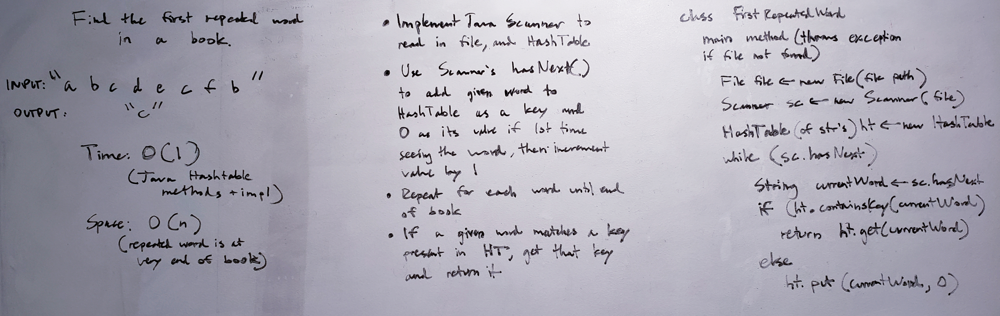

# Challenge Summary
This challenge tests our ability to use a hashtable in order to find the first repeated word in a 'book'.  

## Challenge Description
Using a hashtable, take in each word in a file or string, test to see if it exists in the hashtable, and if it does, return that word. If that word does not exist in the hashtable, add it and keep parsing the file/string. 

## Approach & Efficiency
I implemented a hashtable and a scanner. The scanner was wrapped around a File instance with a user input's file path. The scanner's default delimiter was whitespace, which resulted in a token (word) essentially surrounded by whitespace. If that word existed in the table, return the word. If it didn't, put() it in the hashtable. I made sure to .toLowerCase() a given token and also parse out any punctuation that might proceed the last letter with .replaceAll(regex, replace with). 

## Solution
