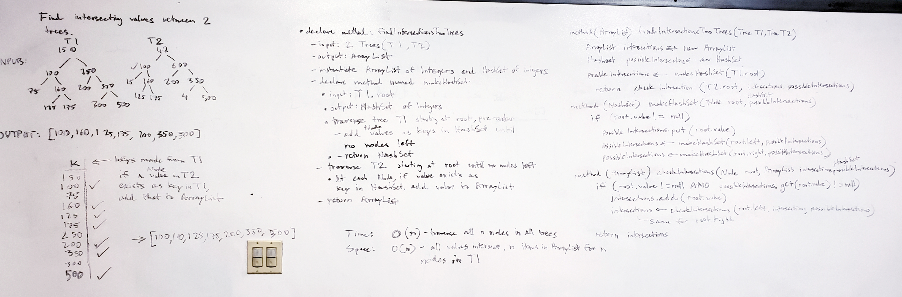

# Find Intersections
This class provides a method for finding the intersections between two trees. 

## Challenge Description
Given the two trees, return all intersections found between two trees. 

## Approach & Efficiency
I created a method for taking in two trees, T1 and T2. I needed a way to have a reference of possible intersections between the two trees before
actually checking for intersections. I instantiated a HashSet to store the values of one tree as keys, so that the other tree's values can be 
checked against the hashset's keys to see if it exists in it. I also instantiated an ArrayList to add those values if there was an intersection. 
I traversed the first tree and added all its values as keys to the hashset. I then traversed the second tree and checked if those values existed
in the hashset, and if it did, I added those values to the arraylist. Finally, I returned the arraylist. 
Time: O(n) - must traverse every tree of n nodes all the way through to check for intersections. 
Space: O(n^2) - assuming worst case of all intersections made for n nodes in a tree, ArrayList created will be n long, and assuming a perfectly
unbalanced tree, the stack created from recursing through the trees will be n tall. Best case space would be O(nlog(n) if the tree was balanced.)

## Solution
